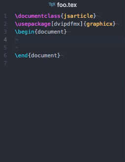

# latex-figs-shortcuts
[](https://codeclimate.com/github/9sako6/latex-figs-shortcuts/maintainability)
[](https://codeclimate.com/github/9sako6/latex-figs-shortcuts/test_coverage)

An Atom package that provides key bindings of "LaTeX/Tables" and "LaTeX/Importing Graphics".



## Tables

```Ctrl + Alt + t```

```
\begin{table}[htb]
  \begin{center}
    \caption{}
    \begin{tabular}{|l|l|} \hline
      & \\ \hline \hline
      & \\ \hline
    \end{tabular}
    \label{}
  \end{center}
\end{table}
```

##  Importing Graphics

```Ctrl + Alt + i```

```
\begin{figure}[htbp]
  \centering
  \includegraphics[width=5cm]{}
  \caption{}
  \label{}
\end{figure}
```

## Installing
Install the package latex-figs-shortcuts in Atom (Preferences->Install) or use Atom's package manager from a shell:

```
$ apm install latex-figs-shortcuts
```


## Notice
Use ```\usepackage[dvipdfmx]{graphicx}``` to import graphics.
